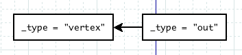

Date: 2014-08-14 00:15:00
Title: Cayley代码分析 - 基本结构
Tags: golang, graphdb
Category: Graph Database

*Cayley*是由golang实现的开源基于triple store的graph database. *Caley* 可以支持多个backend, 比如LevelDB, Bolt, MongoDB和In-Memory Store. 也同时支持Gremlin和MQL的查询方式.

这篇文章主要介绍 In-Memory Store的方式下, *Cayley*采用JavaScript/Gremlin进行查询的过程, 关注点是分析In-Memory方式下的数据结构和查询流程.

<!-- PELICAN_END_SUMMARY -->

## TripleStore

graph database的存储形式有很多种, 而TripleStore是其中常见的一种, TripleStore 如果表示为本文, 将会是下面的样子:

    :::
	1. Alice follows Chester .
	2. Alice follows Mike .
	3. Mike follows Chester .

TripleStore数据存储单元被表示成为Triple, 即三元式, 在Cayley中, 每一个triple还可以有一个label, 因此实际上是Quad(四元式). Quad由四个部分组成:

- `Subject`: 表示发起动作的一方, 比如Quad 1中, Alice是subject
- `Object`: 表示接受动作的一方, 比如Quad 1中, Chester是object
- `Predicate`: 表示`Subject`和`Object`的关系, 在Quad 1中, predicate是follows
- `Label`: 表示整个Quad的标签, 在上面的例子中, lable都是".", 表示为空.

`Quad`用来表示 `Subject`和`Object`之间的`Predicate`关系.  比如例子中的三个Quad, 都是用来表示 某一个人和另外一个人的"follows" 的关系.

因为包含了`Label`, *Cayley* 中的Triple实际上被扩展成为Quad, 但为了符合 TripleStore的语义, 后面的介绍中仍然会出现 Triple来表示*Cayley*中的Triple. 也就是说, 本文后面出现Triple或者Quad时, 描述的都是相同的东西.

## JavaScript/Gremlin

cayley 支持使用JavaScript对数据进行查询, 并且事先定义了类似于 Gremlin的graph对象. cayley内部使用了一个称为[otto][1]的JavaScript解释器, 当用户在REPL直接输入Javascript语句时, 或者通过HTTP发送JavaScript请求, cayley都通过JavaScript解释器来解析并执行JavaScript代码, 对graph database进行查询.

[otto][1] 是一个generic的JavaScript解释器, 本身并不包含graph database相关的内容, cayley在此基础上定义了类似Gremlin的JavasScript API来提供 graph database查询功能.

Cayley在JavaScript环境中预定义了 `graph` 对象来引入graph database的功能. `graph`是一个特殊的对象, 所有的graph database查询都从graph开始. graph对象定义了 `graph.Vertex([nodeId], [nodeId]...)` 方法返回指定了特定vertex的Path Object, `Vertex` 可以接受一个或者多个 vertex的name作为参数. 而该方法实际返回的是一个Path Object, Path Object定义了 `travels methods` 来进行 graph database的遍历. 所以可以把 `Vertex` 函数看作用来指定图遍历的起点. 我们可以把多个调用比如下面的例子 ::

    :::JavaScript
    graph.Vertex("Alice").Out("follows").All()

上面的例子会返回 Alice "follows" 的所有vertex. 这里, `graph.Vertex("Alice")` 首先会返回指定了vertex为 "Alice" 的 Path Object, 随后的调用 `Out` 函数是一个 `traverls method`, `Out("follows")` 表示从之前返回的 Path Object 开始遍历所有向外的 "follows" 的路径, 这同样会得到一个 Path Object, 表示从 "Alice" 开始, 遍历 "follows" 路径(edge), 得到的所有 vertex. 最后调用的 `All` 是一个 `finals method`, 当调用到 `finals method` 时, 便开始输出结果.

从上面的例子可以看出 JavaScript/Gremlin的基本语法. 下面我们来做一下归纳:
1. `graph` JavaScript 对象引入 graph database功能, `graph.Vertex()` 方法返回表示特定vertex的`Path Object`.
2. `Path Object` 定义了 `traverls methods` 和 `finals methods`
3. `traverls methods` 定义了 graph database 的遍历操作, 在 Path Object上调用 `traverls methods` 同样返回Path Object. 比如上面的 `Out()` 方法.
4. `finals methods` 最终返回整个遍历的结果. 比如上面的 `All()` 方法.

## Memory TripleStore

cayley支持多种数据存储的后端, 包括:
* LevelDB
* Bolt
* MongoDB
* In-Memory, ephemeral

这里, 我们只介绍In-Memory的存储方式.

在cayley中, In-Memory的TripleStore定义为下面的样子:

    :::go
    type TripleStore struct {
        idCounter       int64
        tripleIdCounter int64
        idMap           map[string]int64
        revIdMap        map[int64]string
        triples         []quad.Quad
        size            int64
        index           TripleDirectionIndex
    }

* Cayley会为在TripleStore中的每一个triple设置一个tripleId, 而triple中的每一个node, 都会被设置一个Id. 这两个Id都是唯一的. struct中的idCounter和tripeIdCounter就是用来记录当前Id的最大值, 用来为新的triple和triple中的node设置Id.
* idMap记录了从triple的node名字到Id的映射. 可以用于通过名字查找Id的情况
* revIdMap 记录了从node的Id到名字的映射, 可以用于通过Id查找名字的情况
* triples 存储了所有在triplestore中的triple. 这里可以看到, triples实际上是quad.Qaud的slice类型.
* size 存储了TripleStore中的triple的数量
* index index是遍历 TripleStore的关键, 它存储了每一个node在TripleStore中的index. 下面会详细介绍这个 TripleDirectionIndex.

### TripleDirectionIndex

`TripleDirectionIndex`的定义如下:

    :::go
	type TripleDirectionIndex struct {
	    subject   map[int64]*llrb.LLRB
		predicate map[int64]*llrb.LLRB
		object    map[int64]*llrb.LLRB
		label     map[int64]*llrb.LLRB
	}

`TripleDirecitonIndex`中包含了4个map, 针对triple中的每一种node各有一个. map的key是triple的node, 而value则是一个LLRB树. LLRB树中保存了包含了该node的triple. 这样当我们拿到一个node时, 可以很方便的找到所有包含这个node的triple. 这个index在进行 graph database遍历时非常有用.

当我们手里有一个node时, 只需要两步就可以拿到所有的包含这个node的triple:
* 首先, 根据node的类型, 获取到存储LLRB的map
* 然后使用node的id为key, 从map中获取存储了triple的LLRB.

## Graph Database 查询

graph database的查询都是从 `graph` 对象开始, 比如下面的列子:

    :::javascript
	graph.Vertex("Alice").Out("follows").All()

cayley使用了lazy的方式来实现查询过程, 整个过程被分为两步:

1. 当调用 `graph.Vertex()` 和 `travels`方法的时候, cayley实际上在内部创建了相对应的iterator
2. 当执行到 `finals` 方法的时候, cayley开始调用 `iterator.next()` 来获取遍历结果.

所以实际上我们理解了`iterator`的作用, 基本就可以理解 graph database的查询和遍历过程. 本文会涉及下面的一些常用的`iterator`.

### Fixed Iterator

`Fixed Iterator` 指向一个vertex的数据, 调用`Fixed.next()`会按序返回数组中的vertex. `Fixed`中包含了下面的成员:

    :::go
	type Fixed struct {
		values     []graph.Value
		lastIndex  int
		... ...
	}

其中, `values`保存了所有的`Fixed`会返回的node, `lastIndex`保存了下一个返回值的index, 每一次`next()`方法被调用之后, `lastIndex`会被加1, 直到 `lastIndex == len(values)`.

### LinksTo Iterator

`LinksTo` 中包含了下面的一些成员:

    :::go
    type LinksTo struct {
	    ts         graph.TripleStore
		primaryIt  graph.Iterator
		dir        quad.Direction
		nextIt     grpah.Iterator
		result     graph.Value
	}

当构造`LinksTo`的时候, 需要传入三个参数 ::

    :::go
    func NewLinksTo(ts graph.TripleStore, primaryIt graph.Iterator, dir quad.Direction)

`LinksTo.next()`方法会返回TripleStore `ts`中所有`direction = d`node为`primaryIt`中的node的triple. 听起来有一点拗口, 实际上`next()`会做下面的操作:

1. 从`primaryIt`中拿到下一个`node`
2. 根据`node`和`dir`从TripleStore中拿到`triple.direciton = node`的triple. 这个操作是通过TripleStore的TripleDirectionIndex来完成的, 从前面的描述我们知道, TripleDirectionIndex记录了从(direction, node)到TripleStore的映射.

### And Iterator

`And Iterator` 表示多个iterator之间的and关系, 其中包含下面的关键成员:

    :::go
	type And struct {
	    internalIterators []graph.Iterator
		itcount           int
		primaryIt         graph.Iterator
		result            graph.Value
	}

在`And Iterator`的`next()`方法中, 首先会从`pimaryIt`中获取`next`结果, 随后会循环对`internalIterators`中的`iterator`调用`contains()`来确认刚刚返回的`next`结果是否在所有的`iterator`中. 从这里可以看出来, `primaryIt`和`iternalIterators`之间是AND的关系, 地位应该是一致的.

### HasA Iterator
`Has Iterator`是一个从`triple`到`node`的`iterator`,  其中包含下面的关键成员:

    :::go
	type HasA struct {
	    ts           graph.TripleStore
		primaryIt    graph.Iterator
		dir          graph.Direction
		resultIt     graph.Iterator
		result       graph.Value
	}

`Has Iterator`的`next()`方法获取`primaryIt`中的下一个triple, 然后返回该triple在`direction=dir`上的node.

## Graph Database 查询实例

根据上面的`graph iterator`介绍, 我们可以来看一个具体的示例来看一下`iterator`的创建和查询过程.

    :::JavaScript
	graph.Vertex("Alice").Out("follows").All()

根据前面的描述, 可以把上面的示例转换为下面的样子:

    :::JavaScript
	function query() {
	    var vertexes = graph.Vertex("Alice");
		var pathObj1 = vertexes.Out("follows");
		pathObj.All();
	}

*cayley* 采用了lazy的方式进行查询操作, 因此在执行上面的``graph.Vertex()``方法和``vertexes.Out()``方法时, *cayley* 只是构建了``Path Object``, 而在执行最后的`pathObj.All()`时, 才会开始真正的查询操作.

在`pathObj.All()`被调用时, 会进行下面的两个步骤:
- 根据返回的`Path Object`来创建iterator tree. `Path Object`会通过其中的`_gremlin_prev`成员来记录前一个`Path Object`的引用. 这里cayley会反向遍历`Path Object`, 将`Path Object`转化为具有graph遍历语义的`iteartor`
- 对`iterator tree`进行遍历, 调用其`next()`方法来查询graph database.

当调用了`graph.Vertex("Alice").Out("follows")`之后, 实际上会返回一个`Path Object`, 为下图的样子:

- Path Object 包含了 `_gremlin_type`字段来标示类型, 后面会根据不同的类型进行不同的处理
- Path Object 中包含了 `_gremlin_prev` 字段来指向前一个`Path Object`. 因为是采用lazy的方式进行处理, 因此需要记录整个Path Object的构建路径, 后面进行`iterator tree`构造时, 一般都会采用递归的方式处理整个Path Object链表.

`buildIteratorTree()`会采用递归的方式处理`Path Object`链表. 并根据不同的`_gremlin_type`进行不同的处理. 在上面的例子, 其中包括了两种`vertex`和`out`两种object, 类型为`vertex`的object处理比较简单, `buildIteartorTree()`会返回一个`Fixed Iterator`, 其中`Fixed.values`为`Vertex()`方法指定的vertex, 在示例中是vertex "Alice". 而`out`类型的object处理比较复杂.

### Build Out Iterator
当类型为`out`时, 处理会稍微复杂. 结合上面的实例, 这个过程可以用下面的代码来表示:

    :::go
	func buildOutIterator(obj, ts, base) {
		subjectLinks := NewLinksTo(ts = ts, primaryIt = base, dir = quad.Subject)

	    predicateIterator := NewFixed(values = ["follows"])
		predicateLinks := NewLinksTo(ts = ts, primaryIt = predicateIterator, dir = quad.Predicate)

        andIter := NewAnd(internalIterators = [predicateLinks], primaryIt = subjectLinks)

        return NewHasA(ts = ts, primaryIt = andIter, dir = quad.Object)
	}

`graph.Vertex("Alice").out("folows").All()`实际上返回的是所有"Alice" follows的vertex, *cayley* 把这个关系表示成多个iterator. 这里参数base是之前的Path Object, 在这里是类型为`vertex`的object.
- 首先, `subjectLinks` 用来查找到所有 `Subject`为"Alice"的triple.
- 其次, `predicateLinks`用来查找到所有 `Predicate`为 "follows" 的triple.
- 上面的两个iterator通过`And` iterator进行组合, 找到所有`(Subject = "Alice", Predicate = "follows")`的triple
- 最后通过HasA iterator返回上面找到所有triple的Object, 完成所需要的查询.

## In-Memory Backend的查询

根据上面的叙述, graph database查询过程被表示为不同的iterator. 而实际上, 在上面的例子中, 只有在做第一次`Links`的查询是才需要访问`In-Memory Backend`. 这是需要的操作是拿到所有`Subject为Alice`的triple. 会调用`TripleStore.TripleIterator()`方法, 这个方法会使用`(direction = Subject, value = vertex("Alice").id)`为参数从``TripleStore.TripleDirectionIndex`查询到符合条件的triple iterator. 当拿到这个iterator之后, 后面的操作都可以直接在这个iterator上进行操作, 而不需要再次访问 In-Memory Backend.

